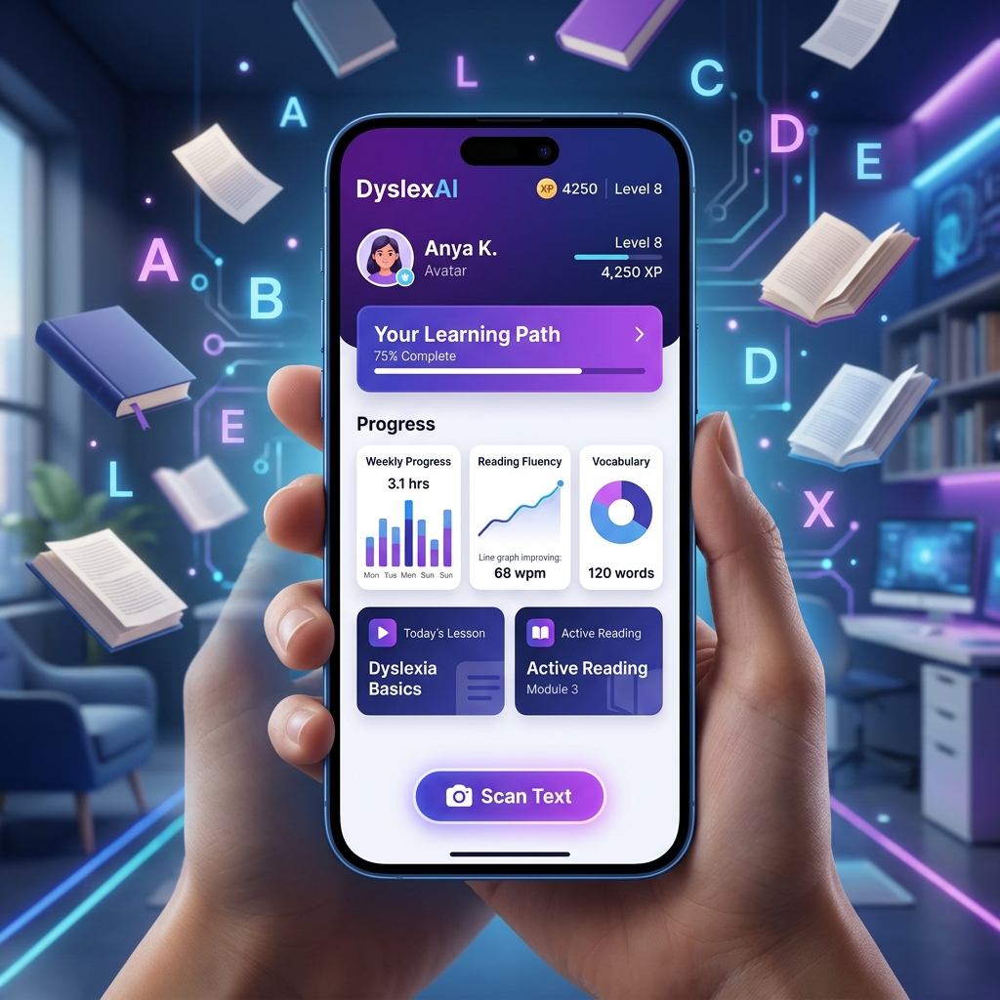

# 📱 DyslexAI: The Future of Dyslexia Support

[](https://opensource.org/licenses/MIT)
[](https://expo.dev/)
[](https://fastapi.tiangolo.com/)

**DyslexAI** is a cutting-edge, AI-powered ecosystem designed to empower individuals with dyslexia. By combining state-of-the-art **OCR (Optical Character Recognition)**, adaptive learning algorithms, and a gamified experience, DyslexAI turns reading and writing challenges into engaging learning opportunities.

---

## 🌟 Visual Preview



### 🎥 Watch the Demo


---

## 🚀 Key Features

### 🔍 Intelligent Handwriting Scan
Using a custom **DocTR + TrOCR** pipeline, DyslexAI can read messy handwriting with verified accuracy. It doesn't just read—it corrects and provides phonetic feedback to help users understand their common mistakes.

### 🎮 Adaptive Game Mode
A 90-day curriculum that evolves with the user. As you play, the system tracks your "confusion patterns" (e.g., mixing up 'b' and 'd') and generates custom challenges to target those specific weaknesses.

### 📊 Real-time Progress Tracking
A professional dashboard for students and teachers. Track XP, streaks, accuracy trends, and mastered word lists in real-time.

### 🎓 Teacher Portal
Teachers can create custom assignments, monitor student progress, and use AI to generate exercises tailored to a student's age and difficulty level.

---

## 🏗️ Architecture

DyslexAI uses a distributed dual-backend architecture to ensure maximum performance for heavy AI tasks:

*   **Mobile Frontend:** React Native (Expo) for a smooth, cross-platform experience.
*   **Exercise Backend:** FastAPI + SQLAlchemy for adaptive logic and gamification.
*   **Scan Backend:** High-performance OCR engine optimized for handwriting recognition.
*   **Database:** Unified SQLite/PostgreSQL synchronization.

---

## 🛠️ Quick Start

### Prerequisites
*   Node.js & Expo CLI
*   Python 3.10+
*   SQLite or PostgreSQL

### Local Setup

1.  **Clone the Repo:**
    ```bash
    git clone https://github.com/abubakarshahid16/dyslexai-mobile.git
    cd dyslexai-mobile
    ```

2.  **Start the Scan Backend:**
    ```bash
    cd scan-backend
    pip install -r requirements.txt
    python run.py
    ```

3.  **Start the Exercise Backend:**
    ```bash
    cd dyslexia-backend
    pip install -r requirements.txt
    uvicorn app.main:app --port 8001
    ```

4.  **Run the App:**
    ```bash
    cd DyslexAI-Mobile
    npm install
    npx expo start
    ```

---

## 📈 Roadmap
- [x] Unified Auth & Database Sync
- [x] Handwriting OCR Correction
- [x] Gamified adaptive curriculum
- [ ] Offline OCR Support
- [ ] Multilingual phonetic analysis

---

## 🤝 Contributing
Contributions are welcome! Please open an issue or submit a pull request for any improvements.

## 📄 License
This project is licensed under the MIT License - see the [LICENSE](LICENSE) file for details.

---
Created with ❤️ by **Abubakar Shahid**
